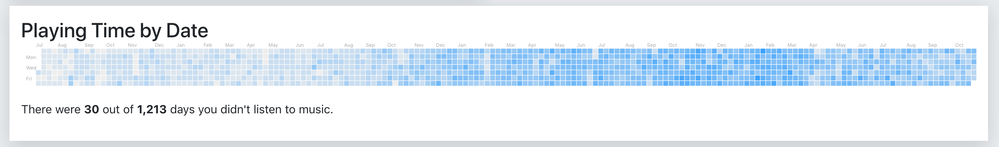

## Music

There are many things that I consider absolutely essential in life and music is one of them. Just ask anyone who knows me and they'll tell you that I'm a huge music aficionado. In fact, there's hardly ever a time that I don't have a pair of headphones on. I listen to it when I'm falling asleep, when I wake up, when I'm working and driving, and when I'm trying to relax. I simply cannot imagine my life without music. 

## Genres

My favorite musical genres are ambient, ambient electronic, dark ambient, downbeat, electronica, orchestral (Scores), Rock, and Blues. If interested, you can view a list of my favorite [artists](music-artists.md), [albums](music-albums.md), and songs.

## Audio Players

I'm an Apple guy so I use Apple's [iTunes](https://www.apple.com/itunes/) player 90% of the time. The other 10% is spent using a small, open-source player called [Cog](https://kode54.net/cog/). Finally, I use a program called [BitPerfect](http://bitperfectsound.com) in combination with iTunes. BitPerfect is a MacOS application that works with iTunes to enable far better sound than you'd get normally.

## Tracking

I track my listening habits via [Apple Music](https://www.apple.com/apple-music/), [iTunes](https://www.apple.com/itunes/), and [Last.fm](https://www.last.fm/user/phmullins). My current iTunes music collection consists of 5,336 songs, taking up 64.83GB of space, and can be played 16.8 days without repeating a song. According to Apple Music I went only 30 out of the last 1,213 days without listening to music.

## Formats

Whenever possible I try to stick with [ALAC](https://en.wikipedia.org/wiki/Apple_Lossless) (Apple Lossless Audio Codec) encoded files. Otherwise, I will go with [FLAC](https://xiph.org/flac/), followed by [AAC](https://en.wikipedia.org/wiki/Advanced_Audio_Coding) and then [MP3](https://en.wikipedia.org/wiki/MP3). Encoding rates are always as high as I possibly can get them. This is why [Bandcamp](https://bandcamp.com/) is my favorite way of obtaining music. Bandcamp currently supports WAV, ALAC, FLAC, AAC, MP3, OOG and many others.

## Hardware

My primary method of listening to music is via my MacBook Pro combined with a USB  [Apogee Groove](https://www.apogeedigital.com/products/groove) AMP/DAC and a pair of Sennheiser [HD660S](https://en-us.sennheiser.com/headphones-audiophile-high-end-hd-660-s) headphones. Secondary method is via my iPhone Xs Max and a pair of Sennheiser [IE 800](https://en-us.sennheiser.com/in-ear-headphones-earphones-ie-800-s-ceramic) or Bose [SoundSport Free](https://www.bose.com/en_us/products/headphones/earphones/soundsport-free-wireless.html) headphones. 

## Links

Check out Bandcamp if you're the type who likes to download and manage your own music library. Otherwise, look to Apple Music or Deezer for music streaming.

- [Apple iTunes](https://www.apple.com/itunes/)
- [Apple Music](https://www.apple.com/apple-music/)
- [Bandcamp](https://bandcamp.com/)
- [Deezer](https://www.deezer.com/en/)
- [Spotify](https://www.spotify.com)

